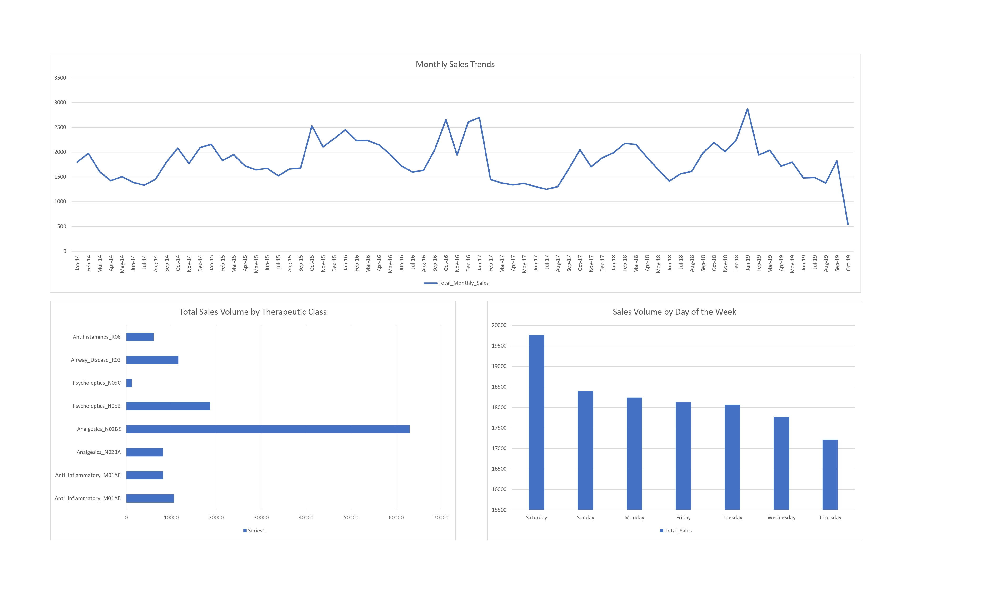

# Pharmaceutical Commercial Analytics & Sales Trends

## Project Overview

This project analyzes daily pharmaceutical sales data to uncover strategic business insights. The objective was to evaluate the performance of various therapeutic drug classes, identify seasonal sales trends, and analyze operational efficiency based on weekday transaction volumes.

## Tools Used

*   **SQL (SQLite):** Used for data extraction, aggregation, and initial exploratory data analysis (EDA).

*   **Microsoft Excel:** Used for data visualization and building a commercial analytics dashboard.

## Key Files

*   `pharmacy_sales_queries.sql`: Contains the structured SQL queries used to aggregate sales by category, month, and day of the week.

*   `sales_daily.csv`: The raw dataset containing daily transactional volume across different drug categories.

*   `Pharmacy_Sales_Dashboard.xlsx`: The final interactive Excel workbook containing the pivot tables and visualizations.

*   `Pharmacy_Sales_Dashboard.pdf`: A high-resolution export of the final commercial analytics reporting dashboard.

## Business Insights Generated

1.  **Portfolio Analysis:** Identified the top-grossing therapeutic classes (e.g., Analgesics and Anti-inflammatories) to understand core revenue drivers.

2.  **Seasonality Forecasting:** Mapped monthly sales trends over a multi-year period to assist in inventory and promotional planning.

3.  **Operational Efficiency:** Analyzed sales volume by day of the week, revealing that Saturdays consistently drive the highest transaction volumes, which can inform targeted weekend marketing or staffing adjustments.

